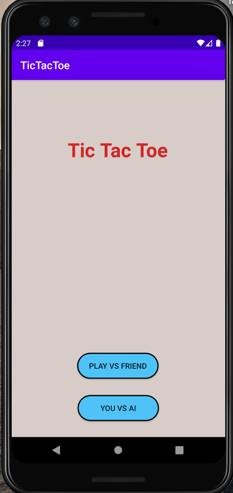
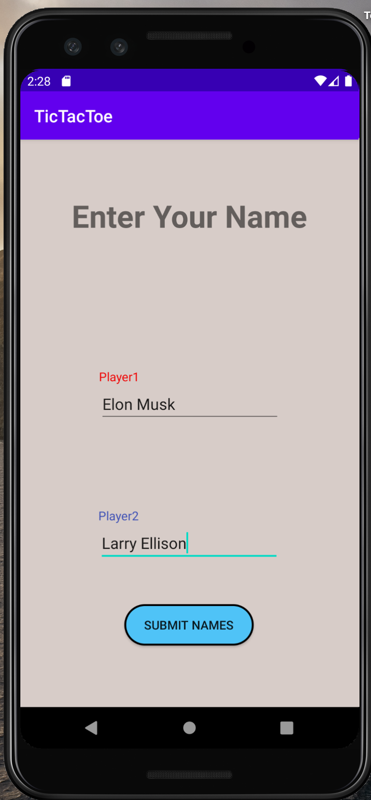
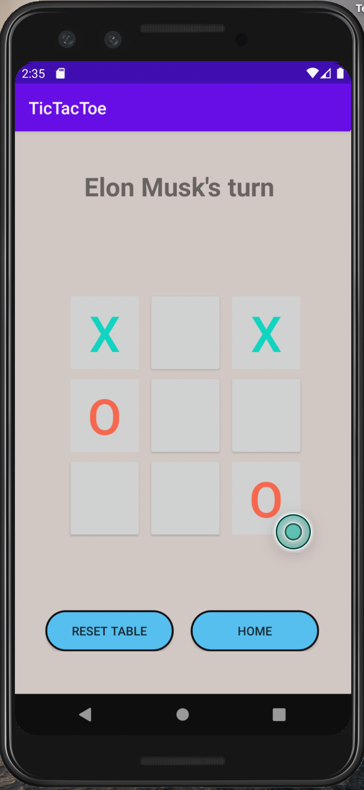

Tic-Tac-Toe - Android App
==============
Tic-tac-toe is a simple, two-player game that, if played optimally by both players, will always result in a tie. The game is also called noughts and crosses or Xs and Os.

Tic-tac-toe is a game that is traditionally played by being drawn on paper, and it can be played on a device , which in this case is an android device.

## Gameplay:
The goal of tic-tac-toe is to be the first player to get three in a row on a 3-by-3 grid.

In a 3-by-3 grid game, the player who is playing "X" always goes first. Players alternate placing Xs and Os on the board until either player has three in a row, horizontally, vertically, or diagonally or until all squares on the grid are filled. If a player is able to draw three Xs or three Os in a row, then that player wins. If all squares are filled and neither player has made a complete row of Xs or Os, then the game is a draw.

One of the game's best strategies involves creating a "fork," which is placing your mark in such a way that you have the opportunity to win two ways on your next turn. Your opponent can only block one, thereby, you can win after that.

## Features:
* Single Player with Computer
* Multiplayer with a friend
* Completely ad-free. 😉

## Screenshots:
###Home Page

###Enter Name

###Players turn

## List of main Files :

* ComputerDisplay.kt
* GamePlayerDisplay.kt
* MainActiviy.kt
* PlayerSetup.kt
* activity_main.xml
* computer_display.xml
* game_display.xml
* player_setup.xml

## Installation instructions:
1. Open android Studio
2. Go to File -> New -> Import project and look for the unzipped file in your computer
3. If you try to run, there will be a prompt message to let you know that you need and Create Virtual Device.(If not skip to 6)
4. So do this, from  your Virtual Devices page of the AVD Manager, click Create Virtual Device.
5. Select a hardware profile, and then click Next.
6. Once the application is successfully imported, Go to Run -> Run App.

## Future features
* Increase difficulty in game play against computer 
* Multiple grid types , including 4-by-4 or 5-by-5
